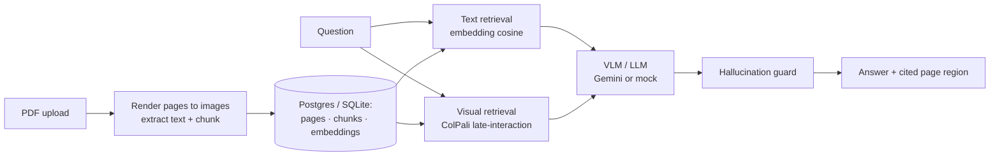

# LensRAG

**Multimodal RAG that reads the charts and tables in your documents — not just the text.**


Most "chat with your PDF" tools only extract the **text** of a document, so every
chart, table and diagram silently vanishes. Ask "what was Q3 revenue?" when that
number only lives in a bar chart and the tool either says *"I don't know"* or —
worse — **invents a number that looks right.**

LensRAG treats each page as an **image**, retrieves the relevant pages with visual
(late-interaction) retrieval, and answers with a **vision-language model** that can
actually read the chart. Every answer comes back with the **exact page region** it
came from, and a **hallucination guard** abstains instead of guessing when the
document doesn't support an answer.

---

## Why it's not another GPT wrapper

| | |
|---|---|
| 📊 **Reads charts & tables** | Pages are retrieved as images and answered by a VLM, so values locked inside a chart survive — where text-only RAG drops them. Visual retrieval uses ColPali/ColQwen2 late-interaction. |
| 📈 **Proves it works** | A 110-question chart/table-QA **evaluation harness** measures the recall gap between text-RAG and visual-RAG, plus per-type answer accuracy — with known ground truth. Evals are the single biggest signal that separates a real system from a demo. |
| 🛡️ **Shows its work** | Answers highlight the exact page region they came from, and the guard abstains when grounding is weak — measured as a first-class metric. |

## Architecture



Every heavy piece has a light, deterministic fallback, so **the whole system runs
offline with no API keys or GPU** — and the real frontier models plug in via config:

| Capability | Offline default | Real (config) |
|---|---|---|
| Generation | `mock` (extractive) | **Gemini** VLM (free tier) |
| Visual retrieval | page-text proxy | **ColPali / ColQwen2** |
| Text embeddings | hashing (no deps) | **BGE** (`bge-small`) |
| Vector store | in-process cosine | Postgres / **pgvector** |

## Product tour

- **Overview** — the pitch, live stats, and whether generation is running on real Gemini or the mock.
- **Library** — drag-and-drop PDF upload; each page is rendered and indexed. Grid of documents with page thumbnails and a lightbox.
- **Ask** — ask across your documents in **Text RAG**, **Visual RAG**, or **Compare** mode. Compare runs both on the same question, side by side. Answers show a confidence bar, the guard state, and clickable citations that highlight the exact region on the page.
- **Evaluation** — the recall gap and answer accuracy as bars (text vs visual), the guard's abstention rate, and the methodology.
- **How it works** — the pipeline, the stack, and the design rationale.

## Quickstart

### Option A — Docker (one command)

```bash
docker compose up --build
# API → http://localhost:8000  ·  Dashboard → http://localhost:3000
```

### Option B — run the pieces directly

**Backend** (Python 3.12):

```bash
cd backend
python -m venv .venv && source .venv/bin/activate
pip install -e ".[dev]"
uvicorn app.main:app --reload      # http://localhost:8000  (docs at /docs)
```

**Frontend** (Node 20):

```bash
cd frontend
npm install
cp .env.local.example .env.local   # points at http://localhost:8000
npm run dev                        # http://localhost:3000
```

Upload a PDF (there are sample reports with charts in `backend/data/corpus/`) and
ask away. It works out of the box on the offline mock.

### Turn on real chart-reading (Gemini, free tier)

Get a free key at <https://aistudio.google.com/app/apikey>, then:

```bash
export LENSRAG_LLM_PROVIDER=gemini
export LENSRAG_GEMINI_API_KEY=AIza...   # free tier; no card required
uvicorn app.main:app --reload
```

Now visual-RAG sends the actual page images to Gemini and reads values straight
off the charts.

## Evaluation

The harness ingests a synthetic corpus whose chart/table values we **control**, so
"did it read the chart right?" is scored precisely.

```bash
cd backend
python -m app.eval.runner                       # offline (mock) — validates the harness
LENSRAG_LLM_PROVIDER=gemini LENSRAG_GEMINI_API_KEY=AIza... python -m app.eval.runner   # real numbers
```

It measures **retrieval recall@k**, **answer accuracy** (numeric within tolerance /
text containment), broken out for chart/table vs text-only questions, and the
**guard's correct-abstention rate** on unanswerable questions. The dashboard reads
the resulting `data/eval/summary.json`.

> **Honest note:** offline (mock) both paths score the same on chart questions —
> they *can't* read a chart image — which is exactly the point: the harness is
> validated, and the recall/accuracy gap appears only once a real VLM (Gemini) or
> ColPali retriever is switched on. See `DESIGN.md`.

## Tech stack

**Backend** FastAPI · SQLAlchemy (async) · Pydantic v2 · PyMuPDF · NumPy
**Retrieval/Gen** ColPali/ColQwen2 · BGE · Gemini · pgvector
**Frontend** Next.js (App Router) · TypeScript · Tailwind CSS
**Infra** Docker Compose · GitHub Actions CI · Terraform · Render blueprint

## Project layout

```
backend/    FastAPI app (routers · services · eval harness) + tests + corpus
frontend/   Next.js dashboard (app/ pages · components · typed API client)
infra/      Terraform template
.github/    CI (backend lint+tests+eval · frontend lint+build)
```

## Tests & CI

```bash
cd backend && pytest -q          # 46 tests
cd frontend && npm run build     # type-check + lint + build
```

CI runs both suites plus an offline eval smoke on every push and PR.

## License

MIT © Samyak Sanklecha
